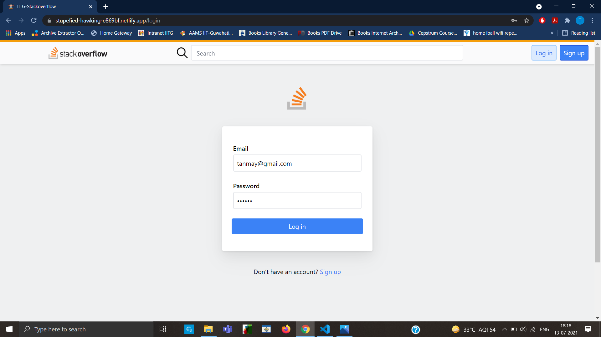
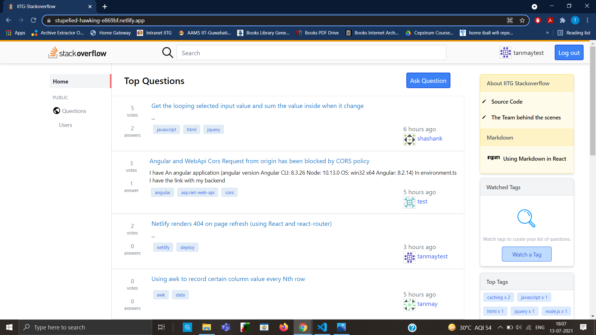
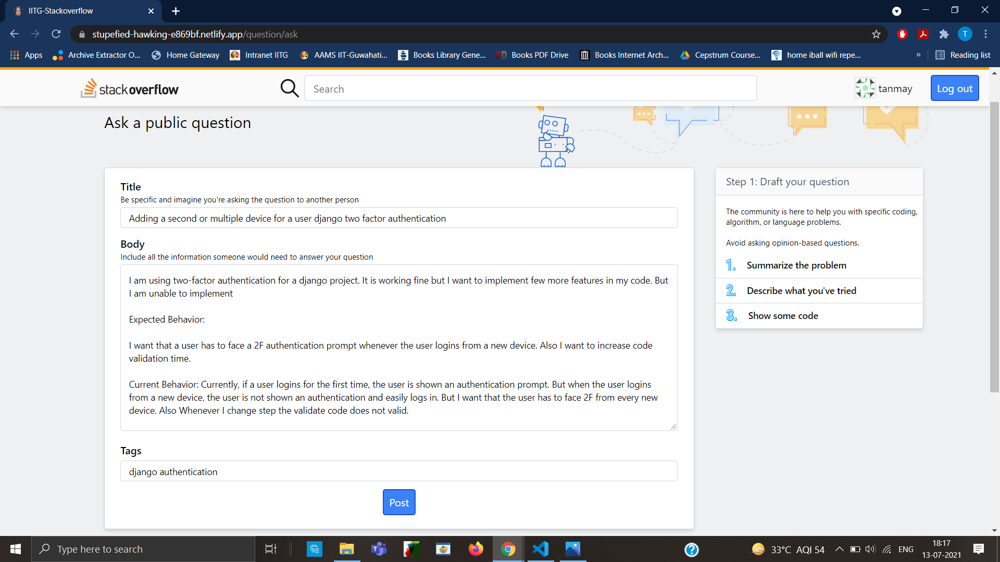
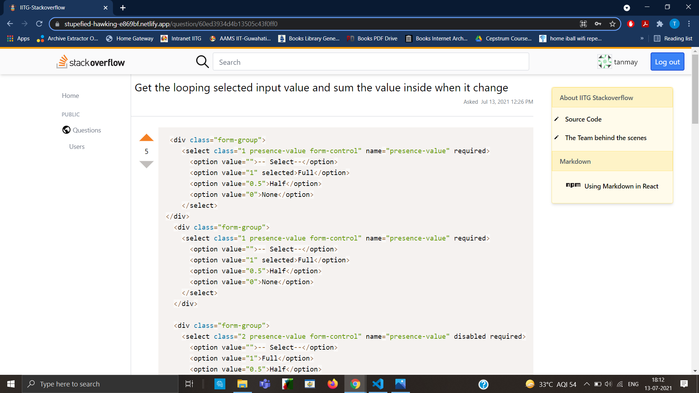
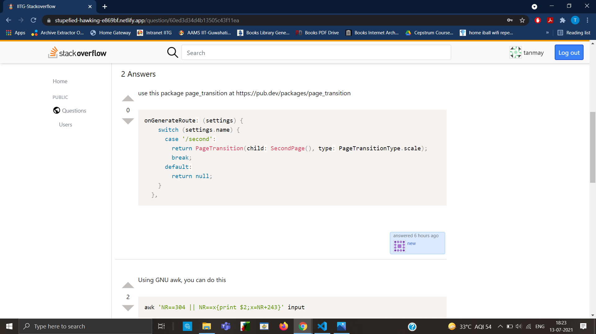
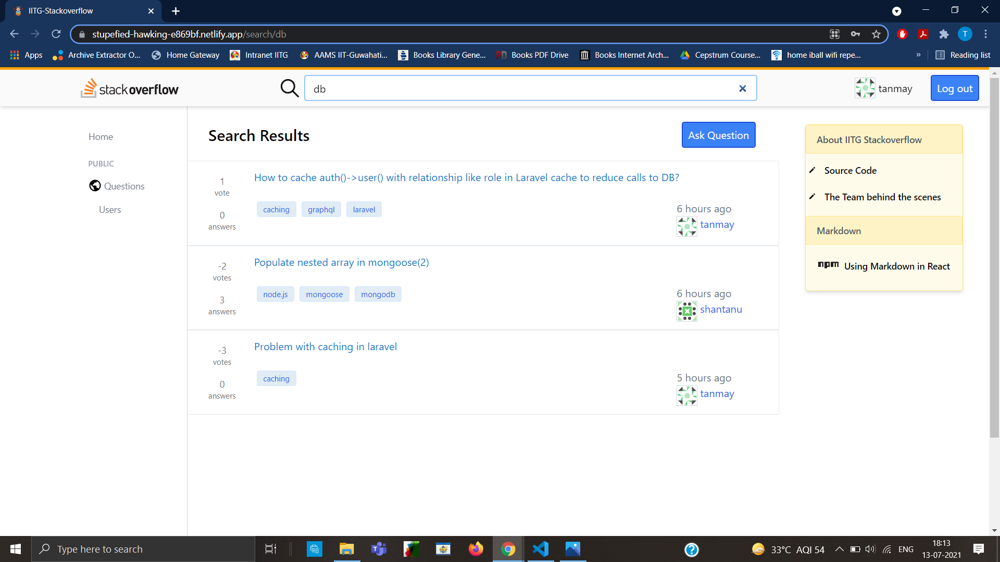
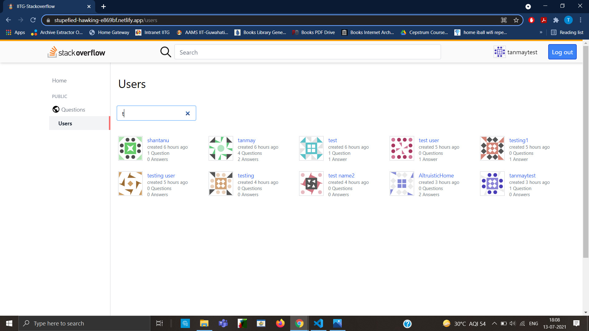
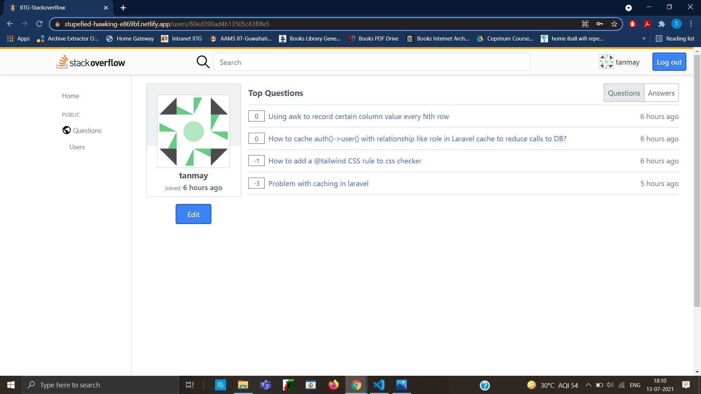
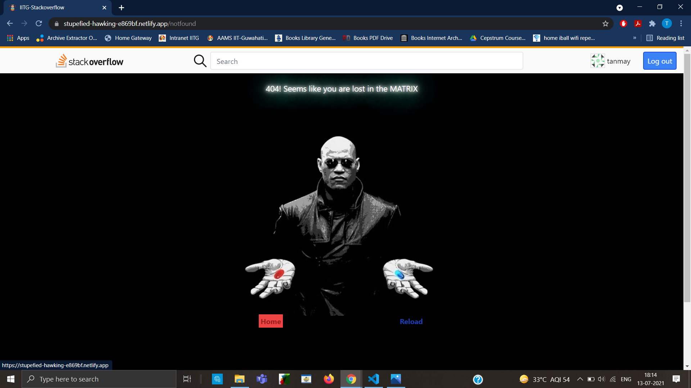

# IITG stackoverflow


## Description
We want to connect the people who have knowledge to the people who need it.  
As a team of 5 developers, we built this Q&A portal to help other developers gain and share insights into a problem.


## Tech Stack [MERN]
#### Front-end
* Front-end Framework: `React.js (with Redux)`
* Styling: `Tailwind CSS`

#### Back-end
* For handling server requests: `Node.js with Express.js Framework`
* As Database: `MongoDB`
* API tested using: `POSTMAN`
* Authentication: `JWT`

## Guidelines to setup

This application requires [Node.js](https://nodejs.org/)

1. Clone the project
    ```
    git clone https://github.com/joat28/iitg-stack-overflow
    ```

2. Create a `.env` file in ```/server``` folder, and setup [Environment Variables](environment-variables).
3. Run these commands then - 
    ```
    npm install
    cd client
    npm install
    ```
4. To start the client and the server 
    ```
    node server/index.js 
    cd client
    npm start
    ```

_NOTE: Might take sometime to start as there will be 2 servers running._

## Environment Variables

To run this project, you will need to add the following environment variables to your .env file
`PORT`, `DB_URI`, `JWT_SECRET_TOKEN`


## API Endpoints

#### Base Url - 
`http://localhost:5000/api`

#### Auth
* `POST /login`
* `POST /register`
* `DELETE /logout`

#### User
* `GET /users`
* `GET /user/:user_id`
* `PATCH /user/:user_id`

#### Answer
* `PATCH /answer/:answer_id`
* `PATCH /answer/vote/:answer_id`
* `DELETE /answer/:answer_id`
* `DELETE /posts/answers/:id`

#### Questions
* `GET /question`
* `GET /question/:question_id`
* `GET /question/top`
* `GET /question/topTags`
* `GET /question/answers/:question_id`
* `POST /question/answers/:question_id`
* `POST /question/ask`
* `POST /question/tags/:pathname`
* `PATCH /question/:question_id`
* `PATCH /question/vote/:question_id`
* `DELETE /question/:question_id`


## Screenshots

#### Register

#### Login

#### Home

#### Ask

#### Question

#### Answer

#### Search

#### Users

#### Profile

#### NotFound


## Acknowledgements

 - [Axios](https://axios-http.com/)
 - [Redux](https://github.com/matiassingers/awesome-readme)
 - [React Markdown](https://bulldogjob.com/news/449-how-to-write-a-good-readme-for-your-github-project)
 - [MongoDB Atlas](https://www.mongodb.com/cloud/atlas)
 - [Mongoose](https://mongoosejs.com/)
 - [Tailwind](https://tailwindcss.com/)
 - [Nodemon](https://nodemon.io/)
 - [Moment](https://momentjs.com/)
 - [Dice Bear](https://avatars.dicebear.com/)
 - [React Syntax Highlighter]()

## Authors

- [Prabhat Rao](https://www.github.com/joat28)
- [Shashank Raj](https://github.com/srj1107)
- [Tanmay Shreshth](https://github.com/TanmayS26)
- [Shantanu Pathak](https://github.com/shantanu689)
- [Kautilya Pandey](https://github.com/kpx3)


**Free Software, Hell Yeah!**

[//]: # (These are reference links used in the body of this note and get stripped out when the markdown processor does its job. There is no need to format nicely because it shouldn't be seen. Thanks SO - http://stackoverflow.com/questions/4823468/store-comments-in-markdown-syntax)

   [dill]: <https://github.com/joemccann/dillinger>
   [git-repo-url]: <https://github.com/joemccann/dillinger.git>
   [john gruber]: <http://daringfireball.net>
   [df1]: <http://daringfireball.net/projects/markdown/>
   [markdown-it]: <https://github.com/markdown-it/markdown-it>
   [Ace Editor]: <http://ace.ajax.org>
   [node.js]: <http://nodejs.org>
   [Twitter Bootstrap]: <http://twitter.github.com/bootstrap/>
   [jQuery]: <http://jquery.com>
   [@tjholowaychuk]: <http://twitter.com/tjholowaychuk>
   [express]: <http://expressjs.com>
   [AngularJS]: <http://angularjs.org>
   [Gulp]: <http://gulpjs.com>

   [PlDb]: <https://github.com/joemccann/dillinger/tree/master/plugins/dropbox/README.md>
   [PlGh]: <https://github.com/joemccann/dillinger/tree/master/plugins/github/README.md>
   [PlGd]: <https://github.com/joemccann/dillinger/tree/master/plugins/googledrive/README.md>
   [PlOd]: <https://github.com/joemccann/dillinger/tree/master/plugins/onedrive/README.md>
   [PlMe]: <https://github.com/joemccann/dillinger/tree/master/plugins/medium/README.md>
   [PlGa]: <https://github.com/RahulHP/dillinger/blob/master/plugins/googleanalytics/README.md>
